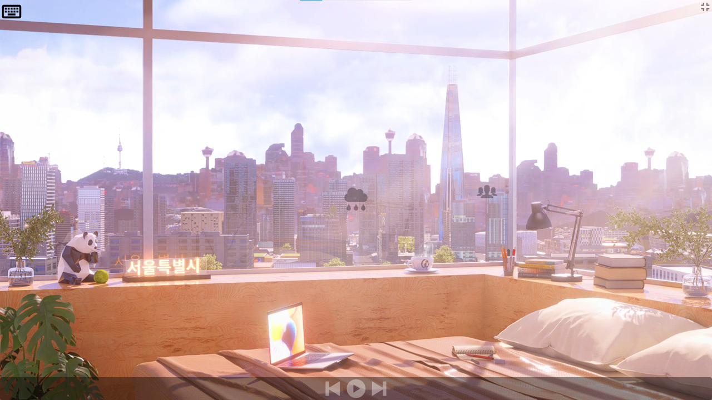
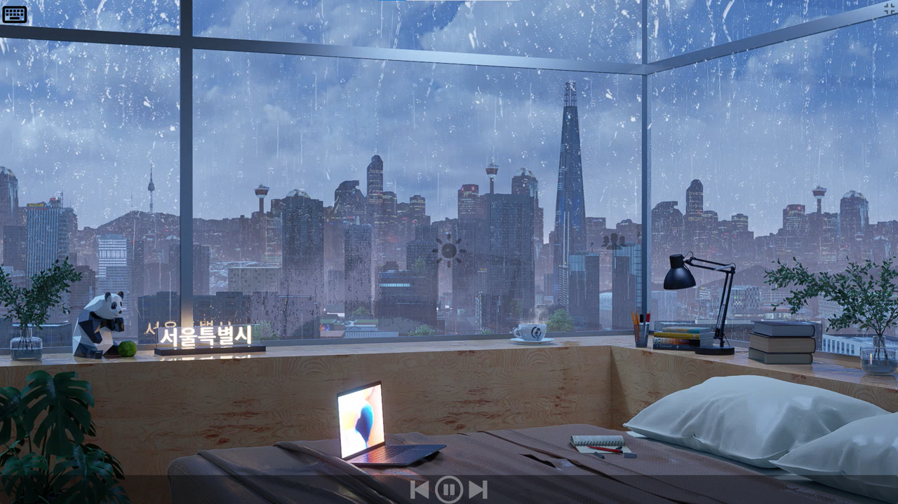

# Serenity Space

## Project Idea

Create a personalized and calming working space that enhances focus, productivity, and relaxation. This project aims to provide users with a customizable environment featuring soothing backgrounds, relaxing music, ambient sounds, and productivity tools.

## Features

- **Soothing Backgrounds:** Choose from a variety of calming backgrounds to create a visually pleasing workspace.

- **Relaxing Music:** Embed a player for background music to help users stay focused and relaxed during work sessions.

- **Ambient Sounds:** Customize your environment with ambient sounds such as wind, rain, storms, people, and campfire.
  
[Live Demo](https://serenity-space.netlify.app/)

## Technologies Used

- JavaScript
- React
- CSS

## Project Status

The Personal Working Space project is currently in active development. It's aimed at creating a serene and productive environment for users during their work sessions. As the project progresses, additional features and improvements will be added.
